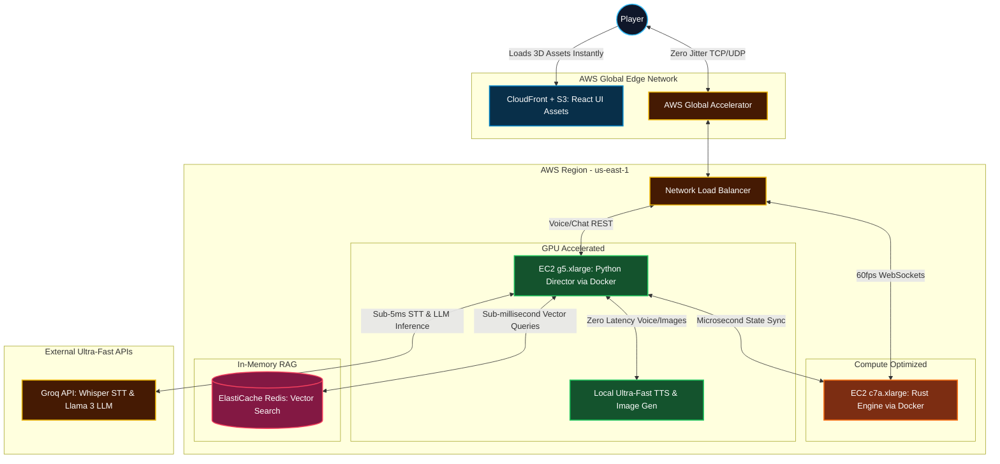

```mermaid
graph TD
    classDef client fill:#0f172a,stroke:#38bdf8,stroke-width:2px,color:#fff
    classDef react fill:#082f49,stroke:#0284c7,stroke-width:2px,color:#fff
    classDef python fill:#14532d,stroke:#22c55e,stroke-width:2px,color:#fff
    classDef rust fill:#7c2d12,stroke:#f97316,stroke-width:2px,color:#fff
    classDef aws fill:#451a03,stroke:#eab308,stroke-width:2px,color:#fff
    classDef db fill:#831843,stroke:#f43f5e,stroke-width:2px,color:#fff

    User((Player)):::client

    subgraph AWS_Global_Edge [AWS Global Edge Network]
        CDN[CloudFront + S3: React UI Assets]:::react
        GA[AWS Global Accelerator]:::aws
    end

    subgraph AWS_Region [AWS Region - us-east-1]
        NLB[Network Load Balancer]:::aws

        subgraph Compute_Rust [Compute Optimized]
            Rust[EC2 c7a.xlarge: Rust Engine via Docker]:::rust
        end

        subgraph Compute_Python [GPU Accelerated]
            FastAPI[EC2 g5.xlarge: Python Director via Docker]:::python
            LocalAI[Local Ultra-Fast TTS & Image Gen]:::python
        end

        subgraph Memory_Tier [In-Memory RAG]
            Redis[(ElastiCache Redis: Vector Search)]:::db
        end
    end

    subgraph External_APIs [External Ultra-Fast APIs]
        Groq[Groq API: Whisper STT & Llama 3 LLM]:::aws
    end

    %% Routing
    User -->|Loads 3D Assets Instantly| CDN
    User <-->|Zero Jitter TCP/UDP| GA
    GA <--> NLB
    
    %% Internal Logic
    NLB <-->|60fps WebSockets| Rust
    NLB <-->|Voice/Chat REST| FastAPI

    FastAPI <-->|Microsecond State Sync| Rust
    FastAPI <-->|Sub-millisecond Vector Queries| Redis
    FastAPI <-->|Zero Latency Voice/Images| LocalAI
    FastAPI <-->|Sub-5ms STT & LLM Inference| Groq
```