# AWS Deployment Architecture — AI Starship Odyssey

This document describes the full AWS production deployment. The local Docker Compose environment mirrors this architecture exactly — swap env vars to switch between local and cloud backends.

---

## Architecture Diagram

```mermaid
graph TD
    classDef client  fill:#0f172a,stroke:#38bdf8,stroke-width:3px,color:#e0f2fe
    classDef cdn     fill:#082f49,stroke:#0284c7,stroke-width:2px,color:#bae6fd
    classDef python  fill:#14532d,stroke:#22c55e,stroke-width:2px,color:#bbf7d0
    classDef rust    fill:#7c2d12,stroke:#f97316,stroke-width:2px,color:#fed7aa
    classDef s3      fill:#451a03,stroke:#eab308,stroke-width:2px,color:#fef08a
    classDef db      fill:#3b0764,stroke:#a855f7,stroke-width:2px,color:#e9d5ff
    classDef bedrock fill:#1e3a5f,stroke:#60a5fa,stroke-width:2px,color:#bfdbfe
    classDef ext     fill:#1c1917,stroke:#a8a29e,stroke-width:2px,color:#d6d3d1

    User((🧑 Player\nBrowser)):::client

    subgraph Edge ["☁️  AWS Global Edge"]
        CDN["🌐 CloudFront\nHTTPS termination\nPath-based routing\n3 origins"]:::cdn
        S3_FE[("📦 S3 Frontend\nstarship-frontend-*\nReact + GLB assets")]:::s3
    end

    subgraph Region ["🏢  AWS us-east-1 — VPC"]
        subgraph Compute ["EC2 Instances"]
            Rust["⚙️ Rust Engine\nc7a.xlarge · 4vCPU · 8GB\nBevy ECS · Warp HTTP\n:8080 REST · :8081 WS\n60fps physics broadcast"]:::rust
            Director["🧠 Python Director\nt3.medium · 2vCPU · 4GB\nFastAPI · LLM Cascade\nTTS · STT · SDXL · RAG\n:8000 WebSocket + REST"]:::python
        end
        subgraph Storage ["Managed Data Services"]
            Redis[("🔴 ElastiCache Redis\nSession vector memory\nKill events · sector state\n(key-value, no RediSearch)")]:::db
            OpenSearch[("🔍 OpenSearch\ngame-lore index\nkNN 1024d vectors\nRAG similarity search")]:::db
            S3_Lore[("📄 S3 Lore Docs\nstarship-lore-docs-*\nRaw uploaded PDFs/TXT/MD")]:::s3
            S3_Saves[("💾 S3 Game Saves\nworld_snap.json\nPlayer stats + entities")]:::s3
        end
        Bedrock["🤖 AWS Bedrock\nTitan Embed v2 · 1024d\nChunk → vector embedding"]:::bedrock
    end

    subgraph External ["🌍  External AI APIs"]
        Gemini["✨ Google Gemini\ngemini-2.5-flash (primary LLM)\ngemini-embedding-001 (local)"]:::ext
        Groq["⚡ Groq\nWhisper STT · Llama 3.3 70B\nLLM tier-2 fallback"]:::ext
        HF["🎨 HuggingFace\nSDXL texture generation\nAI-generated planet surfaces"]:::ext
        ElevenLabs["🎙️ ElevenLabs\nRachel premium TTS voice\nauto-disabled on quota"]:::ext
    end

    User -->|"WSS 60fps input"| CDN
    User -->|"HTTPS voice/text/events"| CDN

    CDN -->|"/ws → :8081 WebSocket"| Rust
    CDN -->|"REST /spawn /save /api/command..."| Rust
    CDN -->|"/api/v1/* dream-stream WS"| Director
    CDN -->|"/api/intelligence/* upload"| Director
    CDN -->|"/assets/audio/* /assets/generated/*"| Director
    CDN -->|"/* default SPA"| S3_FE

    Director <-->|"Spawn / modify / state HTTP"| Rust
    Director <-->|"Session vectors\nkill events · sector memory"| Redis
    Director <-->|"kNN RAG queries\nlore similarity search"| OpenSearch
    Director -->|"Intel Upload\nraw file storage"| S3_Lore
    S3_Lore -.->|"chunk source\n(indexed via Director)"| OpenSearch
    Director -->|"Save / Load\nworld_snap.json"| S3_Saves
    Director <-->|"Titan embeddings\nper lore chunk"| Bedrock
    Bedrock -->|"1024d vectors"| OpenSearch

    Director <-->|"Primary LLM\nworld_state JSON"| Gemini
    Director <-->|"STT transcription\nLLM tier-2"| Groq
    Director <-->|"Texture prompt → PNG"| HF
    Director <-->|"TTS audio stream"| ElevenLabs
```



---

## Local ↔ AWS Parity

| Local (Docker Compose) | AWS Equivalent | How to switch |
| :--- | :--- | :--- |
| `redis/redis-stack-server` | ElastiCache Redis 7.x (key-value only; no RediSearch) | Automatic — vector search gracefully disabled on ElastiCache |
| Gemini embeddings (768d) | Bedrock Titan Embed v2 (1024d) | `USE_AWS_RAG=true` |
| `mock_lore.json` flat file | OpenSearch `game-lore` index (kNN) | `USE_AWS_RAG=true` |
| `data/ingested/` folder watch | S3 `starship-lore-docs-*` bucket | `USE_AWS_RAG=true` (upload via `/api/intelligence/upload`) |
| HuggingFace SDXL cloud API | EC2 g5 local SDXL-Turbo | `AI_MODEL_MODE=LOCAL_GPU` |
| Edge TTS / Piper | XTTS-v2 on g5 GPU | `AI_MODEL_MODE=LOCAL_GPU` |
| Local `world_snap.json` | S3 `starship-game-saves` | `s3_utils.py` (auto when `USE_AWS_RAG=true`) |
| `SELF_URL=http://localhost:8000` | `SELF_URL=https://<your-cf-domain>.cloudfront.net` | Set in deploy script |

---

## CloudFront Path Routing

All traffic enters via a single CloudFront domain — no mixed content issues.

| Path Pattern | Target Origin | Protocol |
| :--- | :--- | :--- |
| `/ws` | Rust Engine `:8081` | WebSocket upgrade |
| `/state`, `/spawn`, `/despawn`, `/modify`, `/save`, `/load`, `/update_player` | Rust Engine `:8080` | HTTP |
| `/api/command`, `/api/engine/*`, `/api/physics`, `/api/factions`, `/api/pause`, `/api/resume` | Rust Engine `:8080` | HTTP |
| `/api/v1/dream-stream` | Director `:8000` | WebSocket upgrade |
| `/api/director/*` | Director `:8000` | HTTP |
| `/api/intelligence/*` | Director `:8000` | HTTP (file upload) |
| `/assets/audio/*`, `/assets/generated/*` | Director `:8000` | HTTP (audio/image streaming) |
| `/*` (default) | S3 Frontend | HTTP (React SPA) |

Origins use `{ip}.nip.io` DNS — CloudFront rejects raw IPs as DomainName.
EC2 Nginx listens on port 80 (http-only; CloudFront handles TLS).

---

## EC2 Instance Sizing

| Service | Instance | vCPU | RAM | GPU | Notes |
| :--- | :--- | :--- | :--- | :--- | :--- |
| Rust Engine | `c7a.xlarge` | 4 | 8 GB | — | CPU-bound ECS physics at 60fps |
| Python Director | `t3.medium` | 2 | 4 GB | — | Cloud APIs: Bedrock + Gemini + Groq + HuggingFace |
| *(GPU upgrade)* | `g5.xlarge` | 8 | 24 GB | A10G | Local SDXL-Turbo + XTTS-v2; set `AI_MODEL_MODE=LOCAL_GPU` |

> GPU upgrade requires AWS Service Quota increase for G instances (`L-DB2E81BA`).

---

## One-Command Deployment

### Prerequisites

1. AWS CLI configured (`aws configure`)
2. Docker Desktop running
3. ECR repositories created: `starship-rust`, `starship-director`
4. EC2 instances running with `starship-ec2-role` IAM role attached
5. `deploy/.env.deploy` filled in (copy from `deploy/.env.deploy.example`)

### Run

```bash
cp deploy/.env.deploy.example deploy/.env.deploy
# Edit deploy/.env.deploy with your AWS values

bash deploy/deploy-all.sh all
# Deploys Rust + Director in parallel, then Frontend
```

Or individually:

```bash
bash deploy/deploy-all.sh rust      # Rust engine only
bash deploy/deploy-all.sh director  # Python Director only
bash deploy/deploy-all.sh frontend  # React → S3 + CloudFront
```

Each script:
1. Builds Docker image locally
2. Pushes to ECR (`{account}.dkr.ecr.{region}.amazonaws.com/starship-{service}`)
3. SSHes to EC2 via Instance Connect API (no keypair needed, 60s temp key)
4. Pulls new image, stops old container, starts with `--restart unless-stopped`
5. Installs/configures Nginx if not present

---

## AWS Resources Required

### One-time setup (create once, reuse across deploys)

#### ECR repositories

```bash
aws ecr create-repository --repository-name starship-rust --region us-east-1
aws ecr create-repository --repository-name starship-director --region us-east-1
```

#### S3 buckets

```bash
aws s3 mb s3://starship-frontend-$(aws sts get-caller-identity --query Account --output text) --region us-east-1
aws s3 mb s3://starship-lore-docs-$(aws sts get-caller-identity --query Account --output text) --region us-east-1
aws s3 mb s3://starship-game-saves --region us-east-1
```

#### ElastiCache Redis

```bash
aws elasticache create-cache-cluster \
  --cache-cluster-id starship-redis \
  --engine redis \
  --cache-node-type cache.t3.micro \
  --num-cache-nodes 1 \
  --region us-east-1
```

#### OpenSearch domain

```bash
aws opensearch create-domain \
  --domain-name starship-knowledge \
  --engine-version OpenSearch_2.11 \
  --cluster-config InstanceType=t3.medium.search,InstanceCount=1 \
  --ebs-options EBSEnabled=true,VolumeType=gp3,VolumeSize=20 \
  --vpc-options SubnetIds=<subnet-id>,SecurityGroupIds=<sg-id> \
  --region us-east-1
```

After creation, create the `game-lore` index with kNN mapping:

```bash
# Run from Director EC2 or via the opensearch_utils.py helper
# Index mapping: text (text), embedding (knn_vector, dim=1024, hnsw/cosinesimil)
```

#### IAM Role for EC2 (`starship-ec2-role`)

Attach these policies:

```text
AmazonBedrockFullAccess
AmazonS3FullAccess
AmazonEC2ContainerRegistryReadOnly
AmazonOpenSearchServiceFullAccess  ← or inline policy with es:ESHttpGet/Post/Put
```

Inline policy for OpenSearch (if not using managed policy):

```json
{
  "Version": "2012-10-17",
  "Statement": [{
    "Effect": "Allow",
    "Action": ["es:ESHttpGet", "es:ESHttpPost", "es:ESHttpPut", "es:ESHttpDelete", "es:ESHttpHead"],
    "Resource": "arn:aws:es:us-east-1:ACCOUNT_ID:domain/starship-knowledge/*"
  }]
}
```

Also update the OpenSearch **domain access policy** to include the role:

```json
{
  "Version": "2012-10-17",
  "Statement": [{
    "Effect": "Allow",
    "Principal": { "AWS": ["arn:aws:iam::ACCOUNT_ID:root", "arn:aws:iam::ACCOUNT_ID:role/starship-ec2-role"] },
    "Action": "es:*",
    "Resource": "arn:aws:es:us-east-1:ACCOUNT_ID:domain/starship-knowledge/*"
  }]
}
```

#### CloudFront distribution

Create a distribution with:
- Origins: `{rust-ip}.nip.io` (port 80, HTTP) + `{director-ip}.nip.io` (port 80, HTTP) + S3 frontend bucket
- Cache behaviors per the path table above
- Default root object: `index.html`
- Error pages: 403/404 → `/index.html` (for React SPA routing)

#### EC2 instances

Launch with:
- AMI: Amazon Linux 2023
- IAM instance profile: `starship-ec2-profile`
- Security groups: open port 80 inbound from `0.0.0.0/0` (CloudFront needs HTTP)
- Install Docker: `sudo dnf install -y docker && sudo systemctl enable --now docker`

---

## Environment Variables (Production)

Set in `deploy/.env.deploy` (never committed):

```bash
# AWS Infrastructure
AWS_ACCOUNT_ID=YOUR_ACCOUNT_ID
AWS_REGION=us-east-1
DIRECTOR_INSTANCE=i-XXXXXXXXXXXXXXXXX
DIRECTOR_IP=0.0.0.0
RUST_INSTANCE=i-XXXXXXXXXXXXXXXXX
RUST_IP=0.0.0.0
CLOUDFRONT_DOMAIN=XXXXXXXXXXXX.cloudfront.net
CLOUDFRONT_ID=XXXXXXXXXXXXX
S3_FRONTEND_BUCKET=starship-frontend-YOUR_ACCOUNT_ID
S3_SAVES_BUCKET=starship-game-saves-YOUR_ACCOUNT_ID
S3_LORE_BUCKET=starship-lore-docs-YOUR_ACCOUNT_ID
REDIS_URL=redis://YOUR_CLUSTER.XXXXX.0001.use1.cache.amazonaws.com:6379
OPENSEARCH_URL=https://vpc-YOUR_DOMAIN.us-east-1.es.amazonaws.com
```

API keys set in root `.env` (also never committed):

```bash
GOOGLE_API_KEY=...
GROQ_API_KEY=...
HF_TOKEN=...
ELEVENLABS_API_KEY=...
GITHUB_API_KEY=...
```

The Director container is launched with these runtime flags:

```bash
USE_AWS_RAG=true
OPENSEARCH_ENDPOINT=https://vpc-starship-knowledge-xxx.us-east-1.es.amazonaws.com
REDIS_URL=redis://...
SELF_URL=https://XXXXXXXXXXXX.cloudfront.net     # CRITICAL: audio URLs must be HTTPS
AI_MODEL_MODE=                                      # empty = cloud APIs only
DEMO_MODE=false
```

> **`SELF_URL` must be the CloudFront HTTPS domain** — not the EC2 IP.
> If set to `http://EC2-IP`, audio file URLs sent to the browser will be HTTP and blocked as Mixed Content.

---

## Known AWS Gotchas

| Issue | Cause | Fix |
| :--- | :--- | :--- |
| ElastiCache `FT.CREATE` = unknown command | Standard Redis doesn't support RediSearch | Graceful fallback: `REDIS_SEARCH_AVAILABLE=False`, app uses key-value store |
| OpenSearch 403 AuthorizationException | IAM role not in domain access policy | Add role ARN to domain access policy AND attach inline IAM policy |
| OpenSearch URL double-`https://` | `OPENSEARCH_ENDPOINT` includes scheme; client added another | Fixed in `opensearch_utils.py`: scheme stripped before passing to client |
| CloudFront rejects raw IP as origin | DomainName must be DNS resolvable | Use `{ip}.nip.io` (wildcard DNS resolving to IP) |
| CloudFront → EC2 504 timeout | Security group blocked port 80 | Open SG inbound port 80 from `0.0.0.0/0` |
| Mixed Content (ws:// from HTTPS page) | Browser blocks non-TLS connections | Route all traffic through CloudFront; use `wss://` and `https://` everywhere |
| Bedrock Titan v2 = 1024d (not 768d) | Gemini embeddings = 768d | `EMBEDDING_DIM` is dynamic in code: `1024 if USE_AWS_RAG else 768` |
| `boto3` ImportError at startup | Not in `requirements.txt` | Added `boto3>=1.34.0` to requirements |
| OpenSearch `aoss` vs `es` service name | `aoss` = Serverless; `es` = managed domain | Fixed in `opensearch_utils.py`: `AWSV4SignerAuth(creds, region, "es")` |
| `/api/intelligence/upload` → S3 (wrong) | CloudFront default behavior → S3 frontend | Added explicit CF behavior `/api/intelligence/*` → director-origin |
| Bedrock cold start timeout (first call) | Bedrock Titan takes ~10s on first call | Timeout set to 10s; first chunk may fail, retry by re-uploading file |
| EC2 Instance Connect key valid 60s only | By design (security) | Scripts regenerate key each deploy run |

---

## Security Notes

- All inter-service traffic via **VPC private subnets** — Redis and OpenSearch not publicly accessible
- CloudFront handles TLS; EC2 Nginx serves HTTP-only on port 80 (internal to CF)
- API keys loaded at container start from environment (not baked into Docker images)
- IAM Instance Role provides AWS credentials automatically — no keys stored on EC2
- `deploy/.env.deploy` and `.env` are in `.gitignore` — never committed
- OpenSearch placed in VPC, accessible only from Director's security group
