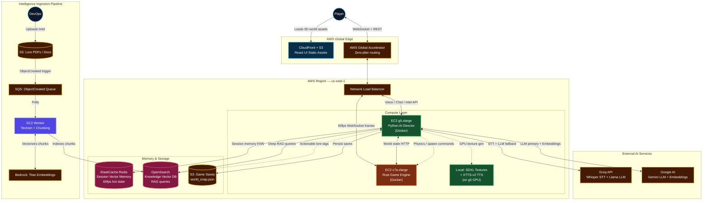

# AWS Deployment Architecture — AI Starship Odyssey

This document describes the full AWS deployment for production. The local Docker Compose environment mirrors this architecture exactly (Redis ↔ ElastiCache, local files ↔ S3, mock_lore.json ↔ OpenSearch).

---

## Architecture Diagram



---

## Local ↔ AWS Parity

| Local (Docker Compose) | AWS Equivalent | Env Switch |
| :--- | :--- | :--- |
| `redis/redis-stack-server` (RediSearch) | ElastiCache Redis OSS 7.x (key-value only; RediSearch not available) | automatic — vector search gracefully disabled |
| Gemini embeddings (768d) | Bedrock Titan Embed v2 (1024d) | `USE_AWS_RAG=true` |
| `mock_lore.json` flat file | OpenSearch vector index | `USE_AWS_RAG=true` |
| HuggingFace SDXL (cloud API) | EC2 g5 local SDXL | `AI_MODEL_MODE=LOCAL_GPU` |
| Edge TTS (cloud) | XTTS-v2 on g5 GPU | `AI_MODEL_MODE=LOCAL_GPU` |
| Local `world_snap.json` | S3 bucket (`/saves/`) | code: `s3_utils.py` |
| `data/ingested/` folder | S3 + SQS + Worker pipeline | `USE_AWS_RAG=true` |

---

## EC2 Instance Sizing

| Service | Instance | vCPU | RAM | GPU | Notes |
| :--- | :--- | :--- | :--- | :--- | :--- |
| Rust Engine | `c7a.xlarge` | 4 | 8 GB | — | CPU-bound ECS physics at 60fps |
| Python Director | `t3.medium`* | 2 | 4 GB | — | Cloud APIs: Gemini LLM + Bedrock Titan embeddings + Groq Whisper + HuggingFace SDXL |
| SQS Worker | `t3.medium` | 2 | 4 GB | — | Textract + chunking + Bedrock calls |

> **\* GPU upgrade path**: Swap `t3.medium` → `g5.xlarge` and set `AI_MODEL_MODE=LOCAL_GPU` to run XTTS-v2 TTS + SDXL texture generation on-device (24GB A10G). Requires AWS Service Quota increase for G instances (`L-DB2E81BA`). Pending for production.

---

## Deployment Steps

### 1. Build & push Docker images to ECR

```bash
# Authenticate
aws ecr get-login-password --region us-east-1 | \
  docker login --username AWS --password-stdin <account-id>.dkr.ecr.us-east-1.amazonaws.com

# Build and push Rust engine
docker build -t starship-rust ./engines/core-state
docker tag starship-rust:latest <ecr-repo>/starship-rust:latest
docker push <ecr-repo>/starship-rust:latest

# Build and push Python Director
docker build -t starship-director ./apps/python-director
docker tag starship-director:latest <ecr-repo>/starship-director:latest
docker push <ecr-repo>/starship-director:latest
```

### 2. Deploy React frontend to S3 + CloudFront

```bash
cd apps/web-client
VITE_DIRECTOR_URL=https://<your-nlb-or-api-domain> npx vite build
aws s3 sync dist/ s3://<your-frontend-bucket>/ --delete
aws cloudfront create-invalidation --distribution-id <dist-id> --paths "/*"
```

### 3. Launch EC2 instances

```bash
# On each EC2 instance, pull and run:
docker pull <ecr-repo>/starship-rust:latest
docker pull <ecr-repo>/starship-director:latest

# Rust Engine
docker run -d --name rust-engine \
  -p 8080:8080 -p 8081:8081 \
  -e PYTHON_DIRECTOR_URL=http://<director-private-ip>:8000 \
  <ecr-repo>/starship-rust:latest

# Python Director (t3.medium — cloud APIs, no GPU)
docker run -d --name python-director \
  -p 8000:8000 \
  -e RUST_ENGINE_URL=http://<rust-public-ip>:8080 \
  -e REDIS_URL=redis://<elasticache-endpoint>:6379 \
  -e SELF_URL=http://<director-public-ip>:8000 \
  -e USE_AWS_RAG=true \
  -e OPENSEARCH_ENDPOINT=https://<opensearch-endpoint> \
  -e AWS_REGION=us-east-1 \
  -e AI_MODEL_MODE= \
  -e GOOGLE_API_KEY=<key> \
  -e GROQ_API_KEY=<key> \
  -e HF_TOKEN=<key> \
  -e ELEVENLABS_API_KEY=<key> \
  <ecr-repo>/starship-director:latest
# Note: add --gpus all and AI_MODEL_MODE=LOCAL_GPU when using g5.xlarge
```

### 4. Create S3 buckets

```bash
aws s3 mb s3://starship-lore-docs --region us-east-1
aws s3 mb s3://starship-game-saves --region us-east-1
```

### 5. Create SQS queue + S3 trigger

```bash
aws sqs create-queue --queue-name starship-lore-ingest
# Add S3 event notification on starship-lore-docs → SQS for ObjectCreated
```

### 6. Create OpenSearch domain

```bash
aws opensearch create-domain \
  --domain-name starship-knowledge \
  --engine-version OpenSearch_2.11 \
  --cluster-config InstanceType=t3.medium.search,InstanceCount=1 \
  --ebs-options EBSEnabled=true,VolumeType=gp3,VolumeSize=20
```

---

## Environment Variables (AWS production)

```env
# Required
GOOGLE_API_KEY=...
GROQ_API_KEY=...
HF_TOKEN=...

# AWS
USE_AWS_RAG=true
OPENSEARCH_ENDPOINT=https://search-starship-knowledge-xxx.us-east-1.es.amazonaws.com
AWS_REGION=us-east-1

# Local GPU (on g5 instance)
AI_MODEL_MODE=LOCAL_GPU

# Optional
ELEVENLABS_API_KEY=...
GITHUB_API_KEY=...
```

---

## Security Notes

- All inter-service traffic flows over **VPC private subnets** — Rust ↔ Director ↔ Redis never exposed to internet
- NLB handles public-facing WebSocket and REST traffic
- API keys stored in **AWS Secrets Manager** and injected at container start (not in ECR image)
- S3 buckets are **private** — CloudFront uses OAC for static asset delivery
- OpenSearch domain placed in VPC, accessible only from Director's security group
