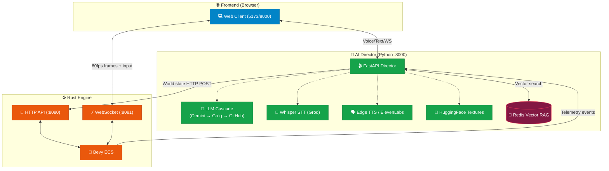

# AI Starship Odyssey — The Void 🚀

An AI-driven space exploration engine with a Rust physics core, Python AI Director, and React/Three.js frontend. The AI Director (Rachel) listens to voice/text commands and dynamically reshapes the universe in real-time: spawning enemies, generating textures, altering gravity, and narrating the action.

> **Status:** Stable, end-to-end operational. Dockerized. Phase 9+ 3D flight controls, AI Dynamic Textures, Redis RAG Memory, Intel Upload Pipeline, Save/Load/Reset, Spectator Mode, and Faction Diplomacy all enabled.

---

## 🌌 Overview

"The Void" is a real-time, voice-interactive space sandbox where the environment and AI agents respond dynamically to your commands. Experience a fully interactive Solar System managed by a high-performance Rust backend and orchestrated by a sophisticated Python AI Director.

Three independent services communicate over WebSocket and HTTP, all orchestrated via Docker Compose.

---

## 🛠️ System Architecture

### Component Breakdown

| Component | Port | Responsibility |
| :--- | :--- | :--- |
| **Web Client (Vite/React)** | `5173` (dev) / `8000/static` (prod) | Three.js 3D scene, HUD, voice input, chat, spectator mode. Sends 60fps player input. |
| **Python Director** | `8000` | AI Director "Rachel". LLM cascade (Gemini → Groq → GitHub), Redis RAG memory, Whisper STT, Edge/ElevenLabs TTS, HuggingFace texture gen, Intel Upload API. |
| **Rust Engine (HTTP)** | `8080` | High-performance ECS engine (Bevy ECS + Warp). Spawning, physics, save/load, factions, collision detection, enemy AI. |
| **Rust Engine (WebSocket)** | `8081` | Real-time 60fps state broadcast to React. Receives player input frames. |
| **Redis (redis-stack)** | `6379` | In-memory vector DB for RAG: session memory, global knowledge base, sector events. Simulates AWS ElastiCache locally. |

### Architectural Flow



---

## 🚀 Quick Start — Docker (Recommended)

### Prerequisites
- Docker Desktop (with Compose v2)
- API keys (see Environment Variables below)

### 1. Clone & configure

```bash
git clone <repo-url>
cd Project
cp .env.example .env
# Fill in your API keys in .env
```

### 2. Launch all services

```bash
docker compose up --build
```

All three services start automatically:
- **Web Client** is served as static files at `http://localhost:8000/` (via Python Director)
- **Python Director** API at `http://localhost:8000`
- **Rust Engine** at `http://localhost:8080` / `ws://localhost:8081`
- **Redis** at `localhost:6379`

### 3. Stop

```bash
docker compose down
```

---

## 🔑 Environment Variables

Copy `.env.example` to `.env` and fill in:

| Variable | Required | Description |
| :--- | :--- | :--- |
| `GOOGLE_API_KEY` | ✅ | Gemini LLM (primary) + Gemini Embeddings for RAG |
| `GROQ_API_KEY` | ✅ | Whisper STT + Groq Llama LLM (tier 2) |
| `HF_TOKEN` | ✅ | HuggingFace — dynamic AI texture generation (SDXL) |
| `ELEVENLABS_API_KEY` | ⚡ optional | Premium TTS voice (auto-disabled if quota exceeded) |
| `GITHUB_API_KEY` | ⚡ optional | GitHub Models LLM fallback (tier 3) |
| `AI_MODEL_MODE` | ⚡ optional | Set to `LOCAL_GPU` to use local Whisper/XTTS/SDXL on GPU |
| `DEMO_MODE` | ⚡ optional | Set to `true` to throttle embedding calls (rate limit protection) |
| `USE_AWS_RAG` | ⚡ optional | Set to `true` to use OpenSearch instead of local Redis for RAG |
| `OPENSEARCH_ENDPOINT` | ⚡ AWS | OpenSearch endpoint URL (required if `USE_AWS_RAG=true`) |
| `AWS_REGION` | ⚡ AWS | AWS region (default: `us-east-1`) |

> **Never commit `.env` with real keys.** `.env` is in `.gitignore`.

---

## 🖥️ Local Development (Without Docker)

### Prerequisites
- Node.js 18+, Rust (stable), Python 3.11+
- Redis Stack running locally on port 6379

### Launch via PowerShell

```powershell
./run_all.ps1   # Starts Director + Engine + Vite dev server
./stop_all.ps1  # Clean shutdown
```

### Build individually

```bash
# Frontend (dev)
cd apps/web-client && npm install && npm run dev

# Frontend (production build)
cd apps/web-client && npx vite build

# Rust engine
cd engines/core-state && cargo build --release
./target/release/core-state

# Python Director
cd apps/python-director && pip install -r requirements.txt
uvicorn main:app --host 0.0.0.0 --port 8000 --reload
```

---

## 🎮 Controls

| Key | Action |
| :--- | :--- |
| **W / ArrowUp** | Thrust forward (full 3D direction) |
| **S / ArrowDown** | Brake (60% reverse thrust) |
| **Mouse (Pointer Lock)** | Look / aim — controls both camera and ship direction |
| **Scroll Wheel** | Zoom |
| **Space** | Fire weapon |
| **Tab / Shift+Tab** | Cycle target lock |
| **M** | Open full Tactical Sector Map |
| **Escape** | Exit pointer lock / close tactical map |

> Click the canvas to enter pointer lock. Press Escape to release.

---

## 🛡️ HUD Features

- **Health bar** — color-coded (green → amber → red)
- **Score & Level** — cinematic warp-speed level transitions
- **AI Objective** — current directive from Rachel
- **Mini radar** — filterable: Sun, Planets, Moons, Hostiles, Stations, Anomalies, Asteroids, Travelers
- **Tactical Sector Map** — full-screen overlay with hover tooltips and click-to-spectate
- **Spectator Mode** — camera follows any entity; engine auto-pauses physics
- **Intel Uplink panel** — drag-and-drop PDF/TXT/MD → Rachel indexes it and answers questions about it
- **Director Console** (left sidebar, resizable) — voice/text interface, chat history, AI state, voice toggle
- **Control buttons** (top-right): 💾 Save · 📂 Load · ↺ Reset · ⏭ Skip Level
- **Death Screen** — dramatic death/restart screen with cause (health / black hole / restart)

---

## 🧠 AI Director — Rachel

### LLM Cascade (10 models, auto-fallback)

| Tier | Models |
| :--- | :--- |
| **1 — Gemini** | `gemini-2.5-flash`, `gemini-2.5-flash-lite`, `gemini-2.5-pro` |
| **2 — Groq** | `llama-3.3-70b-versatile`, `llama-3.1-8b-instant`, `llama-4-scout-17b` |
| **3 — Other** | `qwen3-32b`, `gpt-4o-mini` (slim), `Llama-3.1-8B` (slim), `Mistral-Nemo` (slim) |

### Memory — Redis Vector RAG

- **Session Memory**: Live sector events, player actions, Rachel's observations — stored per-session in Redis with vector embeddings (Gemini `gemini-embedding-001`, 768d)
- **Global Knowledge Base**: `engine_capabilities.md` + `game_knowledge_base.md` — Rust API docs and game lore, indexed into `idx:kb` on startup (background thread, non-blocking)
- **Intel Upload**: Upload any PDF/TXT/MD via the sidebar → chunked, appended to `mock_lore.json`, Rachel notified via WebSocket

### TTS Pipeline

- **Primary**: Edge TTS (Microsoft, free, no quota)
- **Fallback**: ElevenLabs "Rachel" voice — auto-disabled if quota exceeded
- **Local GPU**: XTTS-v2 (if `AI_MODEL_MODE=LOCAL_GPU`)

### STT

- Groq Whisper (cloud, fast)
- Local Whisper (if `AI_MODEL_MODE=LOCAL_GPU`)

---

## 🌐 Save / Load / Reset

| Action | Endpoint | Effect |
| :--- | :--- | :--- |
| **Save** | `POST /save` | Writes `world_snap.json` — player stats + all restorable entities + WorldState |
| **Load** | `POST /load` | Reads `world_snap.json`, despawns dynamic entities, re-spawns from save |
| **Reset** | `POST /api/engine/reset` | Full reset: player → `(8500,500,0)`, enemies cleared, level=1 |
| **Skip Level** | `POST /api/engine/next-level` | Force advance to next wave |
| **Pause** | `POST /api/pause` | Freeze Rust physics (auto-called in spectator/tactical map) |
| **Resume** | `POST /api/resume` | Unfreeze physics |

---

## 🔌 Key REST API Reference (Rust Engine :8080)

| Endpoint | Method | Description |
| :--- | :--- | :--- |
| `/state` | GET/POST | Get or update WorldState |
| `/spawn` | POST | Spawn entity (enemy, station, anomaly, neutral, etc.) |
| `/despawn` | POST | Despawn entities by type / color / IDs |
| `/modify` | POST | Modify entity physics, color, behavior, radius |
| `/save` | POST | Save world snapshot |
| `/load` | POST | Load world snapshot |
| `/update_player` | POST | Update player ship visuals |
| `/set-planet-radius` | POST | Set collision radius for a named celestial body |
| `/api/command` | POST | AI command bus: `set_weapon`, `despawn`, `kill_event`, etc. |
| `/api/engine/reset` | POST | Full game reset |
| `/api/engine/next-level` | POST | Skip to next level |
| `/api/physics` | POST | Update physics constants (gravity, friction, projectile speed) |
| `/api/factions` | POST | Update faction affinity |
| `/api/pause` | POST | Pause physics |
| `/api/resume` | POST | Resume physics |

---

## 🌍 Solar System

All 8 planets + Sun rendered with 2K texture maps. AI can switch rendering mode per planet:
- `glb` — 3D model (default for most planets)
- `texture` — 2K sphere
- AI generates custom textures via HuggingFace SDXL on request

**Approximate sizes:** `Sun (1000)` · `Jupiter (750)` · `Saturn (630)` · `Uranus (420)` · `Neptune (390)` · `Earth (300)` · `Venus (255)` · `Mars (180)` · `Titan (250)` · `Io (200)` · `Europa (180)` · `Luna (80)` · `Mercury (120)` · `Phobos (25)` · `Deimos (18)`

---

## 📂 Project Structure

```text
Project/
├── docker-compose.yml              # All-in-one local + cloud parity deployment
├── .env.example                    # Required environment variables template
├── run_all.ps1                     # PowerShell local launcher (non-Docker)
├── stop_all.ps1                    # PowerShell clean shutdown
├── AWS_ARCHITECTURE.md             # AWS deployment architecture (see for cloud setup)
│
├── engines/core-state/             # Rust game engine (Bevy ECS + Warp)
│   ├── Dockerfile
│   ├── Cargo.toml
│   └── src/
│       ├── main.rs                 # Entry point, WebSocket server, startup
│       ├── api.rs                  # All HTTP API routes
│       ├── game_loop.rs            # 60fps ECS tick, collision, enemy AI, broadcast
│       ├── engine_state.rs         # Shared Arc<Mutex<>> state
│       ├── world.rs                # Entity spawning helpers, save/load
│       ├── components.rs           # ECS components (Transform, Health, Faction, etc.)
│       └── systems.rs              # Physics, steering, faction AI
│
├── apps/python-director/           # Python AI Director
│   ├── Dockerfile
│   ├── main.py                     # FastAPI, LLM cascade, TTS, Redis RAG, STT, Intel Upload
│   ├── pipeline_setup.py           # HuggingFace SDXL texture generation
│   ├── s3_utils.py                 # AWS S3 save/load helpers
│   ├── opensearch_utils.py         # AWS OpenSearch RAG helpers
│   ├── bedrock_utils.py            # AWS Bedrock embedding helpers
│   ├── requirements.txt
│   └── data/
│       ├── engine_capabilities.md  # RAG: Rust API capabilities
│       ├── game_knowledge_base.md  # RAG: game lore and facts
│       └── mock_lore.json          # Dynamic lore (AI-generated + user-uploaded intel)
│
└── apps/web-client/                # React + Three.js frontend
    ├── package.json
    ├── vite.config.ts
    └── src/
        ├── App.tsx                 # Root: WS connections, input loop, game state
        └── components/
            ├── GameScene.tsx       # Three.js canvas
            ├── EntityRenderer.tsx  # All 3D entities (planets, ships, projectiles)
            ├── PlayerShip.tsx      # Player mesh + cockpit
            ├── HUD.tsx             # Radar, tactical map, control buttons
            ├── ChatLog.tsx         # Director conversation history
            ├── ParticleSystem.tsx  # Explosion particles
            └── Starfield.tsx       # Volumetric star background
```

---

## ⚠️ Known Behaviors (Not Bugs)

- **429 Embedding errors in logs after startup**: The KB indexing (18 chunks) runs in a background thread pool. Google Gemini has a rate limit for the free tier. Errors are non-fatal — the game runs fully without KB vectors; RAG still works via in-memory fallback. On AWS, switch `USE_AWS_RAG=true` to use OpenSearch + Bedrock Titan (no rate limits).

- **Black hole death screen**: Currently shows a cinematic overlay. The full "resurrection" sequence is a known in-progress feature.

---

*Built with Antigravity. Powered by Rust, FastAPI, and Redis.*
