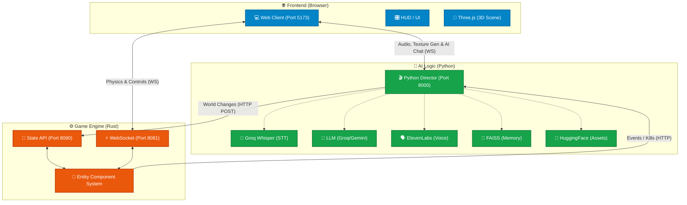

# AI Starship Odyssey (The Void) 🚀

An AI-driven space exploration engine featuring a Rust core for state management, Python for AI orchestration, and a React frontend.

> **Status:** Stable, end-to-end operational. Phase 9+ 3D flight controls fully implemented. AI Dynamic Textures & Synchronous Orchestration enabled.

---

## 🌌 Overview

"The Void" is a real-time, voice-interactive space sandbox where the environment and AI agents respond dynamically to your commands. Experience a fully interactive Solar System managed by a high-performance Rust backend and orchestrated by a sophisticated Python AI Director.

Three independent services communicate over local WebSocket and HTTP to bring this project to life.

---

## 🛠️ System Architecture

### Component Breakdown

| Component | Endpoint | Responsibility |
| :--- | :--- | :--- |
| **Web Client (Vite)** | `http://localhost:5173` | React/Three.js frontend. 3D Visualization, Tactical HUD, voice input processing. Sends player 60fps movement. |
| **Python Director** | `http://localhost:8000` | The "Dream Architect". Manages the LLM (Llama 3 / Gemini), FAISS memory, Groq STT (speech-to-text), ElevenLabs TTS. |
| **Rust Engine (State)** | `http://localhost:8080` | High-performance ECS-based simulation engine in Bevy ECS/Warp. Handles API events for spawning, modifying entities. |
| **Rust Engine (WS)** | `ws://localhost:8081` | Real-time physics broadcast line at 60 FPS. Instantly streams state frames to React and receives user exact coordinates. |

### Architectural Flow Diagram



---

## ⚡ Core Features & Data Flow

### Voice Command to World Change Flow

1. The **Web Client** records your voice and sends it to the **Python Director**.
2. **Director** translates speech to text (Groq Whisper), and determines context via **FAISS** RAG memory.
3. The **LLM** decides whether to spawn enemies, change reality overrides, or generate new dynamic textures.
4. If texture generation is required, **Python** calls **Hugging Face** API, saves the files locally, and serves them to React securely.
5. The **Rust Engine** receives `POST` instructions (like `/spawn` or `/modify`), updating its **ECS**.
6. The exact result is rendered synchronously back to the **Web Client** via `Render Frames`.

---

## 📂 Complete Project Tree

```text
C:\Project\
│
├── engines/
│   └── core-state/                        # Rust game engine (bevy_ecs + warp)
│       ├── Cargo.toml                     
│       ├── src/
│       │   ├── main.rs                    # Game loop, HTTP API, WebSocket server
│       │   ├── components.rs              # Bevy ECS components (Transform, Health, etc)
│       │   └── systems.rs                 # Physics, steering, combat mechanics
│
├── apps/
│   ├── python-director/                   # Python AI Director service
│   │   ├── main.py                        # FastAPI server, LLM, TTS, FAISS
│   │   ├── pipeline_setup.py              # HF dynamic texture generation bypass logic
│   │   ├── requirements.txt               
│   │   ├── .env                           
│   │   └── data/
│   │       └── engine_capabilities.md     # RAG knowledge base for LLM context
│   │
│   └── web-client/                        # React + Three.js frontend
│       ├── package.json                   # dependencies: react, three, @react-three/fiber
│       ├── vite.config.ts
│       ├── index.html                     
│       └── src/
│           ├── main.tsx                   
│           ├── App.tsx                    # Root: handles all WS, inputs, and events
│           └── components/
│               ├── GameScene.tsx          # Three.js canvas setup
│               ├── EntityRenderer.tsx     # Entity dispatchers (stars, planets, ships)
│               ├── PlayerShip.tsx         # User meshing
│               ├── HUD.tsx                # Tactical overlay arrays
│               └── Starfield.tsx          # Dynamic volumetric spatial systems
│
├── data/                                  # 2K planet/star texture maps (PNG/JPG)
├── run_all.ps1                            # PowerShell launcher
├── .env.example                           # Root-level env vars definitions
└── README.md                              # Main documentation (This File)
```

---

## 🔮 Future Roadmap

- **Procedural Planet Surfaces**: Expand Simple spherical meshes into dynamic vertex displacement noise.
- **Dynamic Physics Overrides**: Refine global physics constants dynamically managed by story events.
- **Faction Diplomacy System**: More robust steering mechanics integrating inter-faction relations directly inside Rust components.
- **Infinigen Planet Landing**: Switch to ground-based environments when closing physical proximity limits to celestial bodies.

---

## 🚀 Getting Started

1. **Environment Setup**:
   - Clone the repo.
   - Copy `.env.example` to `.env`.
   - Provide your API keys: `ELEVENLABS_API_KEY`, `HF_TOKEN`, `GROQ_API_KEY`, `GOOGLE_API_KEY`. (Make sure NEVER to commit your real keys!).
2. **Launch**:
   - Run `./run_all.ps1` to start the Director, Rust Engine, and Vite Web Client concurrently.

---
*Built with Antigravity. Powered by Rust & FastAPI.*
