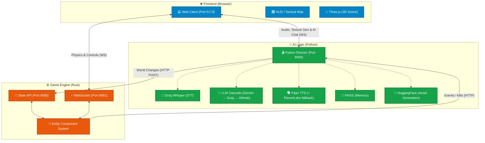

# AI Starship Odyssey (The Void) 🚀

An AI-driven space exploration engine featuring a Rust core for state management, Python for AI orchestration, and a React frontend.

> **Status:** Stable, end-to-end operational. Phase 9+ 3D flight controls fully implemented. AI Dynamic Textures, Synchronous Orchestration, Save/Load System, Spectator Mode, and Faction Diplomacy enabled.

---

## 🌌 Overview

"The Void" is a real-time, voice-interactive space sandbox where the environment and AI agents respond dynamically to your commands. Experience a fully interactive Solar System managed by a high-performance Rust backend and orchestrated by a sophisticated Python AI Director.

Three independent services communicate over local WebSocket and HTTP to bring this project to life.

---

## 🛠️ System Architecture

### Component Breakdown

| Component | Endpoint | Responsibility |
| :--- | :--- | :--- |
| **Web Client (Vite)** | `http://localhost:5173` | React/Three.js frontend. 3D Visualization, Tactical HUD, voice input, chat, spectator mode. Sends player 60fps movement. |
| **Python Director** | `http://localhost:8000` | The "Dream Architect". Manages the LLM cascade (Gemini → Groq → GitHub Models), FAISS memory, Groq Whisper STT, Piper TTS (+ ElevenLabs fallback). |
| **Rust Engine (State)** | `http://localhost:8080` | High-performance ECS-based simulation engine in Bevy ECS/Warp. Handles API events for spawning, modifying, save/load, reset, physics, factions. |
| **Rust Engine (WS)** | `ws://localhost:8081` | Real-time physics broadcast at 60 FPS. Streams state frames to React and receives player input/coordinates. |

### Architectural Flow Diagram



---

## ⚡ Core Features & Data Flow

### Voice/Text Command to World Change Flow

1. The **Web Client** records your voice (or accepts text) and sends it to the **Python Director**.
2. **Director** transcribes speech via **Groq Whisper**, retrieves context from **FAISS** RAG memory (engine capabilities + game knowledge base).
3. The **LLM cascade** (Gemini → Groq Llama → GitHub Models) decides whether to spawn enemies, change reality overrides, modify factions, or generate dynamic textures.
4. If texture generation is required, **Python** calls **Hugging Face** API, saves the files locally, and serves them to React.
5. The **Rust Engine** receives `POST` instructions, updating its **ECS**.
6. The result is rendered synchronously back to the **Web Client** via 60fps `render_frame` WebSocket messages.

---

## 🎮 Controls

| Key | Action |
| :--- | :--- |
| **W / ArrowUp** | Thrust forward (in full 3D direction) |
| **S / ArrowDown** | Brake (60% reverse thrust) |
| **A / ArrowLeft** | Yaw left |
| **D / ArrowRight** | Yaw right |
| **Shift** | Boost / rapid acceleration |
| **Space** | Fire weapon |
| **Tab / Shift+Tab** | Cycle targeting (nearest enemy → farthest) |
| **Mouse (Pointer Lock)** | Look / aim — controls both camera and ship direction |
| **Scroll Wheel** | Zoom (also works in spectator mode) |
| **M (Radar)** | Click radar mini-map to open full Tactical Sector Map |
| **Escape** | Exit spectator mode / close tactical map |

> **Click the canvas** to enter pointer lock. Click again or press Escape to release.

---

## 🛡️ HUD Features

- **Health bar** with color-coded status (green → amber → red)
- **Score & Level counter** with cinematic warp-speed level transitions
- **Objective display** — current mission directive from AI Director
- **Mini radar** (bottom-right) — filterable by entity type (Sun, Planets, Moons, Hostiles, Stations, Anomalies, Asteroids, Travelers)
- **Tactical Sector Map** — full-screen tactical overlay with hover tooltips and click-to-spectate
- **Spectator Mode** — click any entity type pin → camera follows that entity. Engine auto-pauses physics while spectating.
- **Low Orbit Alert** — warning banner when within 150 units of a planetary surface
- **Control buttons** (top-right): 💾 Save · 📂 Load · ↺ Reset · ⏭ Skip Level
- **Director's Console** (left sidebar, resizable) — voice/text interface, chat history, AI state indicator, Rachel voice toggle
- **Death Screen** — dramatic death/restart screen requiring user interaction (with cause: health / black hole / restart)

---

## 🌐 Save / Load / Reset System

| Action | Endpoint | Effect |
| :--- | :--- | :--- |
| **Save** | `POST /save` | Writes `world_snap.json` — player health/score/level + restorable entities + WorldState |
| **Load** | `POST /load` | Reads `world_snap.json`, despawns dynamic entities, re-spawns from save, restores all stats |
| **Reset** | `POST /api/engine/reset` | Full reset: teleports player to `(8500,500,0)`, clears all enemies, level=1, kills=0 |
| **Next Level** | `POST /api/engine/next-level` | Force skip to next wave/level |
| **Pause** | `POST /api/pause` | Freeze all Rust physics (auto-called when tactical map opens or spectator activates) |
| **Resume** | `POST /api/resume` | Unfreeze physics |

---

## 🔌 Full REST API Reference

| Endpoint | Method | Description |
| :--- | :--- | :--- |
| `/state` | GET | Get current WorldState snapshot |
| `/state` | POST | Update WorldState (environment theme, reality overrides, player position) |
| `/spawn` | POST | Spawn a new entity (enemy, station, anomaly, neutral, etc.) |
| `/despawn` | POST | Despawn entities by type, color, or IDs |
| `/modify` | POST | Modify entity physics, color, behavior, radius |
| `/clear` | POST | Clear all dynamic entities |
| `/save` | POST | Save world snapshot to disk |
| `/load` | POST | Load world snapshot from disk |
| `/update_player` | POST | Update player ship visuals (color, model, scale) |
| `/set-planet-radius` | POST | Set collision radius for a named planet/moon/sun |
| `/api/command` | POST | AI command bus: `set_weapon`, `despawn`, `kill_event`, etc. |
| `/api/engine/reset` | POST | Full game reset |
| `/api/engine/next-level` | POST | Skip to next level |
| `/api/physics` | POST | Update physics constants (gravity, friction, projectile speed) |
| `/api/factions` | POST | Update faction affinity pair (−1.0 hostile → +1.0 allied) |
| `/api/pause` | POST | Pause physics simulation |
| `/api/resume` | POST | Resume physics simulation |

---

## 🧠 AI Director — LLM Cascade & TTS

The Python Director uses a **3-tier LLM cascade** to maximize reliability:

1. **Tier 1 — Gemini** (Google): `gemini-2.0-flash-exp` → `gemini-1.5-pro` → `gemini-1.5-flash`
2. **Tier 2 — Groq** (Llama): `llama-3.3-70b-versatile` → `llama-3.1-8b-instant` → `meta-llama/llama-4-scout-17b-16e-instruct`
3. **Tier 3 — GitHub Models** (Azure inference): Llama 3.1 8B / GPT-4o-mini — slim prompt fallback

**TTS Pipeline:**
- **Primary**: Piper TTS (local, offline, no API quota)
- **Fallback**: ElevenLabs ("Rachel" voice) — auto-disabled if quota exceeded or key invalid
- Also supports Edge TTS

**STT:** Groq Whisper (falls back to mock if `GROQ_API_KEY` not set)

**Memory:** FAISS vector search over two knowledge bases:
- `engine_capabilities.md` — available Rust API actions
- `game_knowledge_base.md` — game lore and facts

---

## 🌍 Solar System & 3D Assets

### Planets & Moons
All 8 planets + Sun rendered with 2K texture maps. AI can switch rendering mode per planet:
- `texture` — 2K PNG/JPG texture sphere (default)
- `glb` / `glb_alt` — 3D GLB model (Earth, Mars, Jupiter, Saturn, etc.)

Planet scale overrides (`visual_config.planet_scale_overrides`) let the AI dynamically rescale any celestial body. Collision radii auto-sync via `/set-planet-radius`.

**Solar system sizes (approximate):**
`Sun (1000)` · `Jupiter (750)` · `Saturn (630)` · `Uranus (420)` · `Neptune (390)` · `Earth (300)` · `Venus (255)` · `Mars (180)` · `Mercury (120)` · `Titan (250)` · `Io (200)` · `Europa (180)` · `Luna (80)`

### 3D Models (GLB)
- **Asteroids**: NASA Bennu (1999 RQ36) instanced mesh — up to 200 simultaneous instances
- **Player ship**: Custom combat ship with cockpit dashboard + pilot avatar (GLTF)
- **Neutral ships**: `fighter`, `shuttle`, `suzaku`, `space_shuttle_b`, `rick_cruiser`
- **Anomalies**: Procedural Singularity (black hole visual)
- **Procedural Planets**: GLSL shader-based fallback with simplex noise surface

### Effects
- **Black hole spaghettification**: entities stretch/squash as they enter the gravitational pull zone
- **Particle system**: explosion / death particles
- **SpaceGrid**: spatial reference grid
- **Cinematic level transition**: warp-speed streak overlay on level complete
- **Client-side culling**: dynamic entities culled beyond 15,000 units from player (permanent entities always render)

---

## 📂 Complete Project Tree

```text
C:\Project\
│
├── engines/
│   └── core-state/                        # Rust game engine (bevy_ecs + warp)
│       ├── Cargo.toml
│       └── src/
│           ├── main.rs                    # Entry point, initialization, server startup
│           ├── api.rs                     # All HTTP API routes (warp filters)
│           ├── game_loop.rs               # 60fps ECS tick, WebSocket broadcast
│           ├── engine_state.rs            # Shared state structs (Arc<Mutex<...>>)
│           ├── world.rs                   # World spawning helpers, save/load logic
│           ├── components.rs              # Bevy ECS components (Transform, Health, Faction, etc.)
│           └── systems.rs                 # Physics, steering, combat, faction AI
│
├── apps/
│   ├── python-director/                   # Python AI Director service
│   │   ├── main.py                        # FastAPI server, LLM cascade, TTS, FAISS, STT
│   │   ├── pipeline_setup.py              # HF dynamic texture generation
│   │   ├── requirements.txt
│   │   ├── .env                           # API keys (never commit!)
│   │   └── data/
│   │       ├── engine_capabilities.md     # RAG: Rust API capabilities for LLM
│   │       └── game_knowledge_base.md     # RAG: game lore and narrative facts
│   │
│   └── web-client/                        # React + Three.js frontend
│       ├── package.json
│       ├── vite.config.ts
│       ├── index.html
│       └── src/
│           ├── main.tsx
│           ├── App.tsx                    # Root: WS connections, input loop, game state
│           ├── three/
│           │   ├── CameraSystem.tsx       # Camera follow / spectator camera logic
│           │   └── entities/
│           │       └── Anomalies.tsx      # Black hole / singularity visual
│           └── components/
│               ├── GameScene.tsx          # Three.js canvas setup
│               ├── EntityRenderer.tsx     # Dispatches all 3D entities (planets, ships, etc.)
│               ├── PlayerShip.tsx         # Player mesh, cockpit, pilot avatar
│               ├── ProceduralPlanet.tsx   # GLSL shader planet (noise-based surface)
│               ├── HUD.tsx                # Tactical overlay, radar, spectator, control buttons
│               ├── ChatLog.tsx            # Director conversation history display
│               ├── ParticleSystem.tsx     # Explosion / death particle effects
│               ├── SpaceGrid.tsx          # Spatial reference grid
│               └── Starfield.tsx          # Volumetric star background
│
├── data/                                  # 2K planet/star texture maps (PNG/JPG)
│   └── .cache/                            # Auto-generated texture registry (AI textures)
├── run_all.ps1                            # PowerShell launcher (Director + Engine + Vite)
├── stop_all.ps1                           # PowerShell clean shutdown script
├── .env.example                           # Root-level env var definitions
└── README.md                              # Main documentation (This File)
```

---

## 🚀 Getting Started

1. **Environment Setup**:
   - Clone the repo.
   - Copy `.env.example` to `.env`.
   - Provide your API keys (**never commit real keys!**):
     - `GROQ_API_KEY` — Whisper STT + Groq LLM tier
     - `GOOGLE_API_KEY` — Gemini LLM tier (primary)
     - `HF_TOKEN` — HuggingFace dynamic texture generation
     - `ELEVENLABS_API_KEY` — (optional) premium TTS voice
     - `GITHUB_API_KEY` — (optional) GitHub Models LLM fallback

2. **Launch**:
   - Run `./run_all.ps1` to start the Director, Rust Engine, and Vite Web Client concurrently.
   - Run `./stop_all.ps1` to cleanly shut everything down.

3. **Build individually**:
   ```bash
   # Frontend
   cd apps/web-client && npx vite build

   # Rust engine
   cd engines/core-state && cargo build --release
   ```

---

## 🔮 Future Roadmap

- **Procedural Planet Landing**: Switch to ground-based environments when approaching planetary surfaces.
- **Dynamic Physics Overrides**: Story-driven changes to global gravity and friction constants.
- **Faction Diplomacy Events**: AI-driven inter-faction war declarations with visual fleet movements.
- **Procedural Planet Surfaces**: Vertex displacement noise for terrain detail on approach.

---

*Built with Antigravity. Powered by Rust & FastAPI.*
