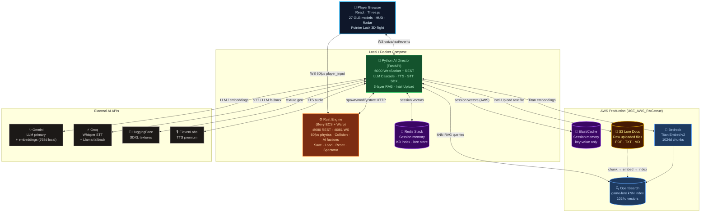

# AI Starship Odyssey — The Void 🚀

An AI-driven space exploration engine with a Rust physics core, Python AI Director, and React/Three.js frontend. The AI Director (Rachel) listens to voice/text commands and dynamically reshapes the universe in real-time: spawning enemies, generating textures, altering gravity, and narrating the action.

> **Status:** Stable, end-to-end operational. Dockerized. Phase 9+ 3D flight controls, AI Dynamic Textures, Redis RAG Memory, Intel Upload Pipeline (→ S3 + OpenSearch on AWS), Save/Load/Reset, Spectator Mode, and Faction Diplomacy all enabled.

---

## 🌌 Overview

"The Void" is a real-time, voice-interactive space sandbox where the environment and AI agents respond dynamically to your commands. Experience a fully interactive Solar System managed by a high-performance Rust backend and orchestrated by a sophisticated Python AI Director.

Three independent services communicate over WebSocket and HTTP, all orchestrated via Docker Compose for local development and fully deployable to AWS via one-command deploy scripts.

---

## 🛠️ System Architecture

### System Diagram



### Component Breakdown

| Component | Port | Responsibility |
| :--- | :--- | :--- |
| **Web Client (Vite/React)** | `5173` (dev) | Three.js 3D scene, HUD, voice input, chat, spectator mode. Sends 60fps player input. |
| **Python Director** | `8000` | AI Director "Rachel". LLM cascade (Gemini → Groq → GitHub), Redis/OpenSearch RAG, Whisper STT, Edge/ElevenLabs TTS, HuggingFace SDXL texture gen, Intel Upload API. |
| **Rust Engine (HTTP)** | `8080` | High-performance ECS engine (Bevy ECS + Warp). Spawning, physics, save/load, factions, collision detection, enemy AI. |
| **Rust Engine (WebSocket)** | `8081` | Real-time 60fps state broadcast to React. Receives player input frames. |
| **Redis (redis-stack)** | `6379` | In-memory vector DB for RAG: session memory, global knowledge base, sector events. Simulates AWS ElastiCache locally. |

### Architectural Flow

```
  ┌─────────────────────────────────────────────────────────────────────────┐
  │                        Player Browser                                   │
  │          React · Three.js · 27 GLB models · HUD · Radar                │
  └──────────────────┬────────────────────────────┬───────────────────────┘
         WS 60fps input (player_input)    WS voice/text/events
                     │                            │
                     ▼                            ▼
     ┌───────────────────────┐      ┌─────────────────────────────────┐
     │     Rust Engine       │◄─────│     Python AI Director          │
     │     (Bevy ECS)        │      │     (FastAPI)                   │
     │  :8080 REST           │      │  :8000 WebSocket + REST         │
     │  :8081 WS broadcast   │      │                                 │
     │                       │      │  LLM Cascade (10 models)        │
     │  60fps physics tick   │      │  TTS: Edge / ElevenLabs / XTTS  │
     │  Collision detection  │      │  STT: Groq Whisper              │
     │  Enemy AI / factions  │      │  SDXL: AI texture generation    │
     │  Save / Load / Reset  │      │  RAG: 3-layer memory system     │
     └───────────────────────┘      │  Intel Upload: PDF/TXT → index  │
                                    └──────┬──────────────────────────┘
                                           │
              ┌────────────────────────────┼──────────────────────────────┐
              │                            │                              │
              ▼                            ▼                              ▼
  ┌────────────────────┐      ┌────────────────────────┐    ┌─────────────────────┐
  │ Redis (local)      │      │ OpenSearch (AWS)        │    │ S3 Lore Docs (AWS)  │
  │ ElastiCache (AWS)  │      │ game-lore index         │    │ raw PDF/TXT/MD      │
  │ Session memory     │      │ kNN 1024d vector search │    │ uploaded intel      │
  │ kill events        │      │ RAG similarity queries  │    └──────────┬──────────┘
  └────────────────────┘      └────────────────────────┘               │ chunks
                                           ▲                            │ embedded
                                           │              ┌─────────────▼──────────┐
                                           └──────────────│ AWS Bedrock             │
                                       vectors            │ Titan Embed v2 · 1024d  │
                                                          └─────────────────────────┘
```

**Local:** Docker Compose (Redis Stack, Gemini embeddings 768d, mock_lore.json)
**Production:** AWS — CloudFront → EC2 → ElastiCache + OpenSearch + Bedrock Titan (1024d)

---

## 🚀 Quick Start — Docker (Recommended)

### Prerequisites
- Docker Desktop (with Compose v2)
- API keys (see Environment Variables below)

### 1. Clone & configure

```bash
git clone <repo-url>
cd Project
cp .env.example .env
# Fill in your API keys in .env
```

### 2. Launch all services

```bash
docker compose up --build
```

All services start automatically:
- **Python Director** + static frontend at `http://localhost:8000`
- **Rust Engine** at `http://localhost:8080` / `ws://localhost:8081`
- **Redis** at `localhost:6379`

Open `http://localhost:5173` (Vite dev) or `http://localhost:8000` (Docker static).

### 3. Stop

```bash
docker compose down
```

---

## 🔑 Environment Variables

Copy `.env.example` to `.env` and fill in:

| Variable | Required | Description |
| :--- | :--- | :--- |
| `GOOGLE_API_KEY` | ✅ | Gemini LLM (primary) + Gemini Embeddings for local RAG |
| `GROQ_API_KEY` | ✅ | Whisper STT + Groq Llama LLM (tier 2 fallback) |
| `HF_TOKEN` | ✅ | HuggingFace — AI texture generation via SDXL |
| `ELEVENLABS_API_KEY` | ⚡ optional | Premium Rachel TTS voice (auto-disabled if quota exceeded) |
| `GITHUB_API_KEY` | ⚡ optional | GitHub Models LLM fallback (tier 3) |
| `AI_MODEL_MODE` | ⚡ optional | Set `LOCAL_GPU` for local Whisper/XTTS/SDXL on GPU |
| `DEMO_MODE` | ⚡ optional | Set `true` to throttle embedding calls (rate limit protection) |
| `USE_AWS_RAG` | ⚡ AWS | Set `true` to use OpenSearch + Bedrock Titan instead of local Redis |
| `OPENSEARCH_ENDPOINT` | ⚡ AWS | OpenSearch domain endpoint (required if `USE_AWS_RAG=true`) |
| `AWS_REGION` | ⚡ AWS | AWS region (default: `us-east-1`) |

> **Never commit `.env` with real keys.** `.env` is in `.gitignore`.

---

## 🖥️ Local Development (Without Docker)

### Prerequisites
- Node.js 18+, Rust (stable toolchain), Python 3.11+
- Redis Stack running locally on port 6379

### Build and run individually

```bash
# Frontend (dev server)
cd apps/web-client && npm install && npm run dev
# → http://localhost:5173

# Frontend (production build)
cd apps/web-client && npx vite build

# Rust engine
cd engines/core-state && cargo build --release
./target/release/core-state

# Python Director
cd apps/python-director && pip install -r requirements.txt
uvicorn main:app --host 0.0.0.0 --port 8000 --reload
```

### PowerShell launchers (Windows)

```powershell
./run_all.ps1   # Starts Director + Engine + Vite dev server
./stop_all.ps1  # Clean shutdown
```

---

## ☁️ AWS Deployment — One Command

The `deploy/` directory contains fully scripted deployment to AWS.

### Prerequisites
- AWS CLI configured with credentials
- Docker Desktop running
- EC2 instances already launched (see [AWS_ARCHITECTURE.md](AWS_ARCHITECTURE.md))
- `deploy/.env.deploy` filled in (copy from `deploy/.env.deploy.example`)

### Setup

```bash
cp deploy/.env.deploy.example deploy/.env.deploy
# Fill in your AWS values (instance IDs, IPs, CloudFront ID, etc.)
```

### Deploy everything

```bash
bash deploy/deploy-all.sh all        # Rust + Director in parallel, then Frontend

# Or individually:
bash deploy/deploy-all.sh rust       # Rust engine only
bash deploy/deploy-all.sh director   # Python Director only
bash deploy/deploy-all.sh frontend   # React → S3 + CloudFront invalidation
```

Each script:
1. Builds a Docker image locally
2. Pushes to ECR
3. SSHes to EC2 via Instance Connect (no keypair needed)
4. Pulls and restarts the container with `--restart unless-stopped`
5. Configures Nginx (port 80 proxy for CloudFront)

> **`deploy/.env.deploy` is in `.gitignore` and never committed.**
> API keys are loaded from root `.env` (also gitignored).

---

## 🎮 Controls

| Key | Action |
| :--- | :--- |
| **W / ArrowUp** | Thrust forward (full 3D direction from mouse look) |
| **S / ArrowDown** | Brake (60% reverse thrust) |
| **Mouse (Pointer Lock)** | Look / aim — controls both camera and ship direction |
| **Scroll Wheel** | Zoom |
| **Space** | Fire weapon |
| **Tab / Shift+Tab** | Cycle target lock (nearest hostile) |
| **M** | Open full Tactical Sector Map (pauses physics) |
| **Escape** | Exit pointer lock / close tactical map |

> Click the canvas to enter pointer lock. Press Escape to release.

---

## 🛡️ HUD Features

- **Health bar** — color-coded (green → amber → red)
- **Score & Level** — cinematic warp-speed level transitions
- **AI Objective** — current directive from Rachel
- **Mini radar** — filterable: Sun, Planets, Moons, Hostiles, Stations, Anomalies, Asteroids, Travelers
- **Tactical Sector Map** — full-screen overlay with hover tooltips and click-to-spectate
- **Spectator Mode** — camera follows any entity; engine auto-pauses physics
- **Intel Uplink panel** — drag-and-drop PDF/TXT/MD → chunked → indexed into Redis (local) or OpenSearch (AWS) → Rachel answers questions about it
- **Director Console** (left sidebar, resizable) — voice/text interface, chat history, AI state, voice toggle
- **Control buttons** (top-right): 💾 Save · 📂 Load · ↺ Reset · ⏭ Skip Level
- **Death Screen** — dramatic death/restart screen with cause (health / black hole / restart)

---

## 🧠 AI Director — Rachel

### LLM Cascade (10 models, auto-fallback)

| Tier | Provider | Models | Notes |
| :--- | :--- | :--- | :--- |
| **1** | Google Gemini | `gemini-2.5-flash` · `gemini-2.5-flash-lite` · `gemini-2.5-pro` | Primary — fastest response |
| **2** | Groq | `llama-3.3-70b-versatile` · `llama-3.1-8b-instant` · `llama-4-scout-17b` | Fallback on Gemini quota |
| **3** | GitHub Models | `qwen3-32b` · `gpt-4o-mini` · `Llama-3.1-8B` · `Mistral-Nemo` | Last resort |

If any model fails (rate limit, timeout, API error), the next is tried automatically within the same request.

### Memory — Three-Layer RAG

| Layer | Storage | What it holds |
| :--- | :--- | :--- |
| **Session Memory** | Redis / ElastiCache | Live sector events, player actions, kills, deaths — per-session vector embeddings |
| **Global Knowledge Base** | Redis `idx:kb` (local) / OpenSearch (AWS) | `engine_capabilities.md` + `game_knowledge_base.md` — indexed at startup |
| **Intel Uplink** | `mock_lore.json` (local) / S3 + OpenSearch (AWS) | User-uploaded PDFs/TXT/MD — chunked, embedded, searchable immediately |

**Local embeddings:** Gemini `gemini-embedding-001` (768d)
**AWS embeddings:** Bedrock Titan Embed v2 (1024d)

### Intel Upload Flow (AWS)

```
User drops file in UI
  → POST /api/intelligence/upload
  → Save to data/ingested/
  → Chunk (500 words, 50-word overlap)
  → Write to mock_lore.json (always)
  → [USE_AWS_RAG=true]
      → Upload raw file to S3 (starship-lore-docs-*)
      → Bedrock Titan embedding per chunk
      → Index into OpenSearch game-lore index
  → Rachel announces in chat: "[INTEL UPLINK] ... N segments indexed"
```

### TTS Pipeline

- **Primary**: Edge TTS (Microsoft, free, no quota)
- **Secondary**: ElevenLabs "Rachel" voice — auto-disabled if quota exceeded
- **Local GPU**: XTTS-v2 (if `AI_MODEL_MODE=LOCAL_GPU`)

### STT

- Groq Whisper (cloud, fast, ~500ms)
- Local Whisper (if `AI_MODEL_MODE=LOCAL_GPU`)

### Voice Commands (examples)

| Say | What happens |
| :--- | :--- |
| "Spawn 10 pirates" | Rust spawns 10 enemy ships |
| "Make pirates fight each other" | Faction affinity → -1.0 |
| "Turn off gravity" | `gravity_scale` → 0 |
| "Give me a scatter cannon" | Weapon: 10 bullets, wide spread |
| "Cloak my ship" | `is_cloaked: true` |
| "Spawn a black hole ahead" | Anomaly: black_hole, mass: 1000 |
| "Generate a lava texture for Mars" | SDXL texture generation |
| "What happened in the Neon Abyss?" | RAG query → lore response |

---

## 🌐 Save / Load / Reset

| Action | Endpoint | Effect |
| :--- | :--- | :--- |
| **Save** | `POST /save` | Writes `world_snap.json` — player stats + all restorable entities + WorldState |
| **Load** | `POST /load` | Reads `world_snap.json`, despawns dynamic entities, re-spawns from save |
| **Reset** | `POST /api/engine/reset` | Full reset: player → `(8500,500,0)`, enemies cleared, level=1 |
| **Skip Level** | `POST /api/engine/next-level` | Force advance to next wave |
| **Pause** | `POST /api/pause` | Freeze physics (auto-called in spectator/tactical map) |
| **Resume** | `POST /api/resume` | Unfreeze physics |

---

## 🔌 Key REST API Reference (Rust Engine :8080)

| Endpoint | Method | Description |
| :--- | :--- | :--- |
| `/state` | GET/POST | Get or update WorldState |
| `/spawn` | POST | Spawn entity (enemy, station, anomaly, companion, etc.) |
| `/despawn` | POST | Despawn entities by type / color / IDs |
| `/modify` | POST | Modify entity physics, color, behavior |
| `/save` | POST | Save world snapshot |
| `/load` | POST | Load world snapshot |
| `/update_player` | POST | Update player ship visuals (model_type, color, is_cloaked) |
| `/set-planet-radius` | POST | Sync visual scale ↔ physics collision radius |
| `/api/command` | POST | AI command bus: `set_weapon`, `despawn`, `kill_event`, etc. |
| `/api/engine/reset` | POST | Full game reset |
| `/api/engine/next-level` | POST | Skip to next level |
| `/api/physics` | POST | Update physics constants (gravity_scale, friction, projectile_speed_mult) |
| `/api/factions` | POST | Update faction affinity (-1.0 to 1.0) |
| `/api/pause` | POST | Pause physics |
| `/api/resume` | POST | Resume physics |

### Python Director API (:8000)

| Endpoint | Method | Description |
| :--- | :--- | :--- |
| `/api/v1/dream-stream` | WebSocket | Main voice/text/events interface |
| `/api/intelligence/upload` | POST | Upload PDF/TXT/MD → chunk → embed → index into RAG |
| `/api/director/save` | POST | Save director session state (optionally to S3) |
| `/api/director/load` | POST | Load director session from save slot |
| `/engine_telemetry` | POST | Receive game events (kills, deaths, level_up, anomaly) |

---

## 🌍 Solar System

All planets rendered with GLB 3D models or 2K texture spheres. AI can generate custom textures via HuggingFace SDXL on request.

**Planet sizes (collision radius):** `Sun (1000)` · `Jupiter (750)` · `Saturn (630)` · `Uranus (420)` · `Neptune (390)` · `Earth (300)` · `Venus (255)` · `Titan (250)` · `Io (200)` · `Europa (180)` · `Mars (180)` · `Mercury (120)` · `Luna (80)` · `Phobos (25)` · `Deimos (18)`

**27 GLB models:** NASA Bennu asteroid, Space Shuttle, Space Stations (Gateway, MAVEN, TDRS), ships (fighter, Rick & Morty, suzaku), anomalies (supernova), companions (astronaut, robonaut), and more.

---

## 📂 Project Structure

```
Project/
├── docker-compose.yml              # All-in-one local deployment
├── .env.example                    # Required environment variables template
├── run_all.ps1                     # PowerShell local launcher (non-Docker)
├── stop_all.ps1                    # PowerShell clean shutdown
├── README.md                       # This file
├── AWS_ARCHITECTURE.md             # Full AWS deployment guide
│
├── deploy/                         # AWS deployment scripts
│   ├── deploy-all.sh               # Deploy everything (Rust + Director + Frontend)
│   ├── deploy-rust.sh              # Rust engine → ECR → EC2
│   ├── deploy-director.sh          # Python Director → ECR → EC2
│   ├── deploy-frontend.sh          # React → S3 + CloudFront invalidation
│   └── .env.deploy.example         # AWS infra config template (copy → .env.deploy)
│
├── engines/core-state/             # Rust game engine (Bevy ECS + Warp)
│   ├── Dockerfile
│   ├── Cargo.toml
│   └── src/
│       ├── main.rs                 # Entry point, WebSocket server, startup
│       ├── api.rs                  # All HTTP API routes
│       ├── game_loop.rs            # 60fps ECS tick, collision, enemy AI, broadcast
│       ├── engine_state.rs         # Shared Arc<Mutex<>> state
│       ├── world.rs                # Entity spawning helpers, save/load
│       ├── components.rs           # ECS components (Transform, Health, Faction, etc.)
│       └── systems.rs              # Physics, steering, faction AI
│
├── apps/python-director/           # Python AI Director
│   ├── Dockerfile
│   ├── main.py                     # FastAPI, LLM cascade, TTS, RAG, STT, Intel Upload
│   ├── pipeline_setup.py           # HuggingFace SDXL texture generation
│   ├── s3_utils.py                 # AWS S3: game saves + lore file uploads
│   ├── opensearch_utils.py         # AWS OpenSearch: vector RAG queries + indexing
│   ├── bedrock_utils.py            # AWS Bedrock: Titan embeddings + Claude responses
│   ├── requirements.txt
│   └── data/
│       ├── engine_capabilities.md  # RAG: Rust API capabilities (auto-indexed at startup)
│       ├── game_knowledge_base.md  # RAG: game lore and facts (auto-indexed at startup)
│       ├── mock_lore.json          # Dynamic lore (user-uploaded intel appended here)
│       └── ingested/               # Raw uploaded files (PDF/TXT/MD)
│
└── apps/web-client/                # React + Three.js frontend
    ├── package.json
    ├── vite.config.ts
    └── src/
        ├── App.tsx                 # Root: WS connections, input loop, game state
        └── components/
            ├── GameScene.tsx       # Three.js canvas
            ├── EntityRenderer.tsx  # All 3D entities (planets, ships, projectiles, GLB)
            ├── PlayerShip.tsx      # Player mesh + cockpit
            ├── HUD.tsx             # Radar, tactical map, control buttons
            ├── ChatLog.tsx         # Director conversation history
            ├── ParticleSystem.tsx  # Explosion particles
            └── Starfield.tsx       # Volumetric star background
```

---

## ⚠️ Known Behaviors (Not Bugs)

- **429 Embedding errors at startup**: KB indexing (20 chunks) runs in a background thread. Gemini free tier has rate limits. Non-fatal — game runs fully; on AWS use `USE_AWS_RAG=true` for Bedrock Titan (no rate limits).

- **ElastiCache RediSearch not available**: Standard ElastiCache Redis does not support RediSearch (`FT.CREATE`). The app gracefully disables vector search and falls back to key-value store. On AWS, RAG queries go through OpenSearch instead.

- **First Bedrock embedding cold start**: The first call to Bedrock Titan after container start may time out (~10s). Subsequent calls are fast (<1s). The chunk is skipped; re-upload the file to retry.

- **Black hole death screen**: Shows a cinematic overlay. The "resurrection" sequence is a known in-progress feature.

---

*Built with Antigravity. Powered by Rust, FastAPI, Redis, and AWS.*
